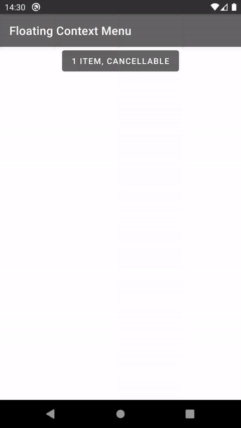
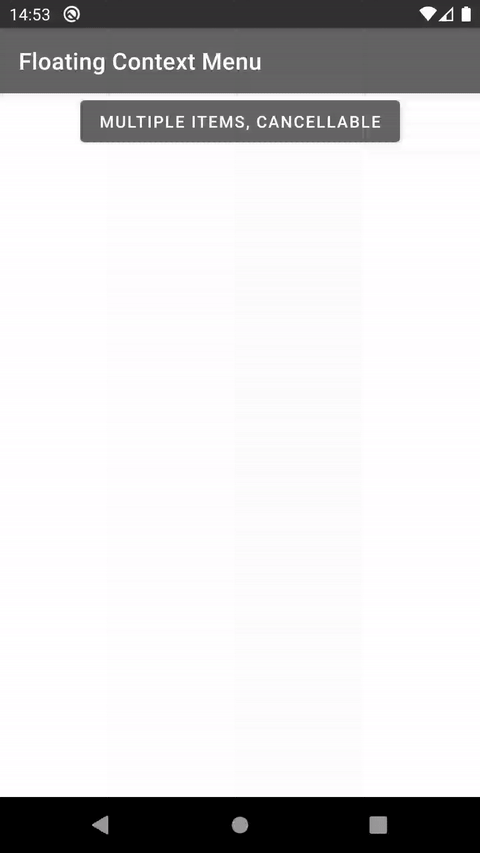
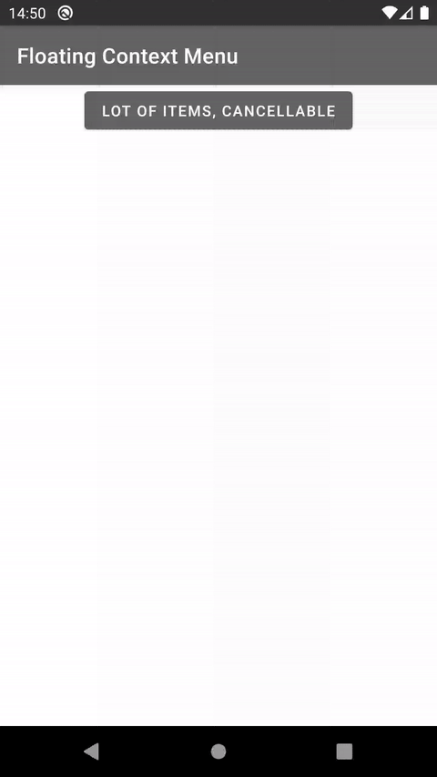
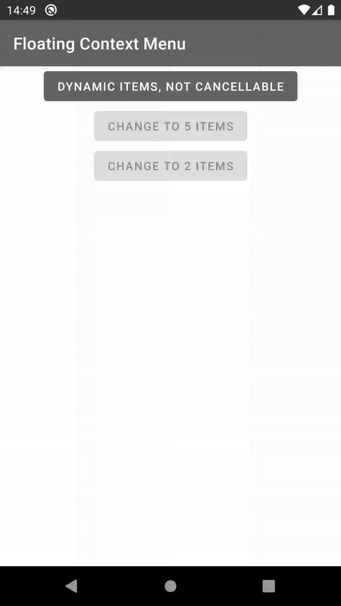
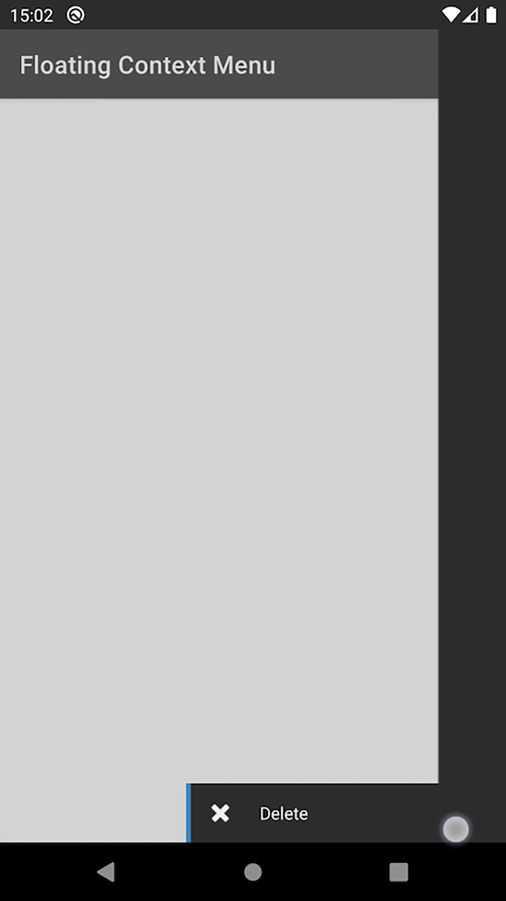
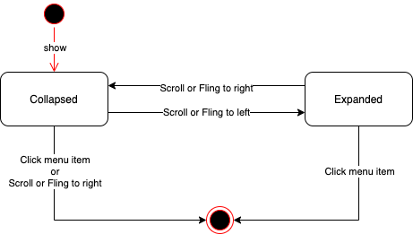
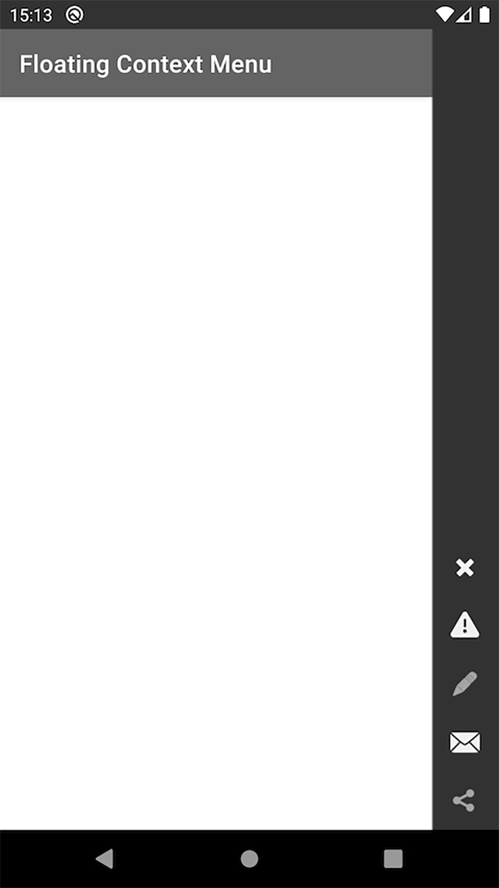
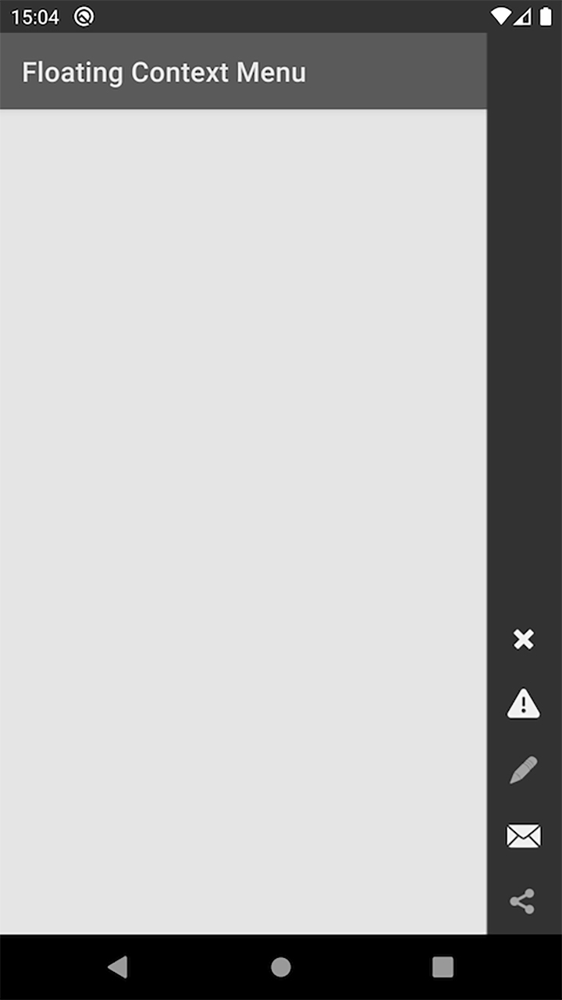
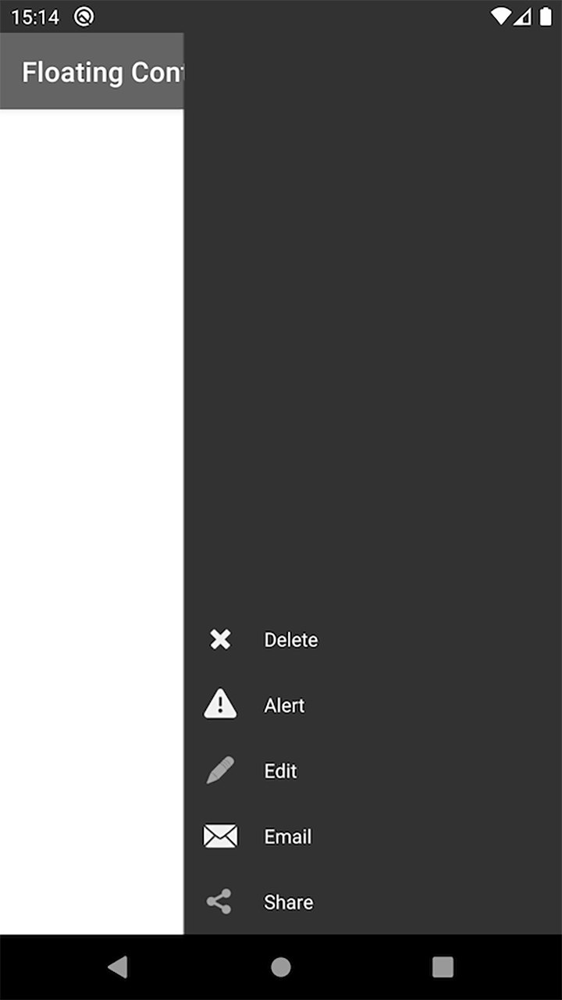
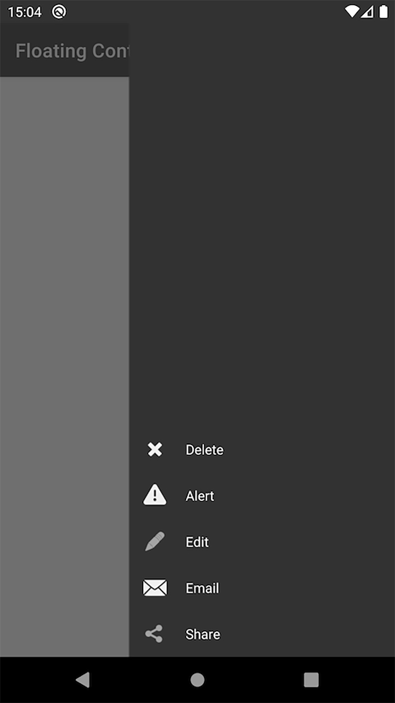

# Android UI Floating Context Menu

Just another way to show the context menu.

First, this idea is came from Blackberry 10. I am not the creator of the idea.

Second, I didn't full copy the UX from there since it required some OS native support.

Now, let's see the show case first.

#### Show case

P.S. Sorry that the video is in low quality



|Single Item|Multiple Items|Lot of Items|Dynamic Items|
|---|---|---|---|
|||||

| |Collapsed|Expanded|
|---|---|---|
|Long Press of the Menu Item||No effect|

#### Information Detail

This is the state diagram of the context menu.



##### Use Cases

1. Context menu for specific item
2. Context menu in a list for multiple items

With that, there is a flag `cancellable` to control it.

|Cancellable|False|True|
|---|---|---|
|Collapsed|||
|Expanded|||
|Tap to Cancellable|N/A|Shadow Area Only|
|Drag to Expand/Collapse|Menu Area Only|Shadow Area and Menu Area|
|Touch to components behind the menu|Non Menu Area Only|N/A|

#### Integration Guideline

1. Include the module [lib-ui](lib-ui) into your project.
2. Simply call the function
```
FloatingContextMenu.make(
        context = context,
        items = items,
        listener = listener,
        cancelable = true
).show()
```

- I am **NOT** going to publish this to any maven server to give the flexibility for all of you to change it.
- For the examples in the show case, please refer to this source file: [MainActivity.kt](app/src/main/java/com/codedeco/lib/floatingcontextmenu/MainActivity.kt)
- There is **NO** blocking for multiple calls inside the menu class, you have to take care by yourselves. It is same when you click multiple time on a button to show an AlertDialog.

#### Known Issues

- The expansion animation of the menu item shifted while the list is scrolling
